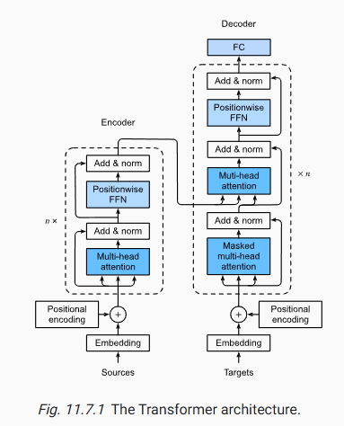
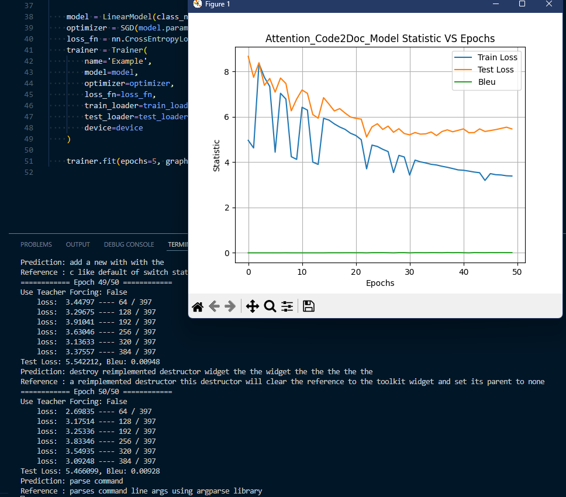
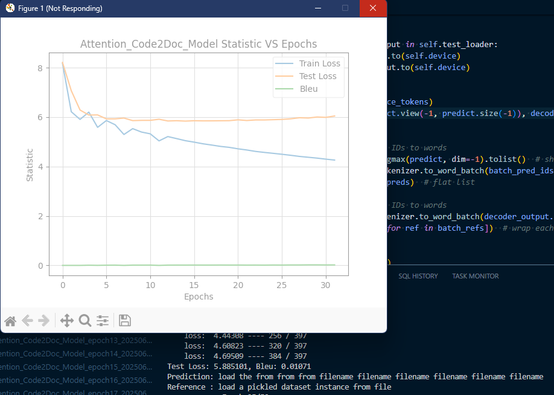
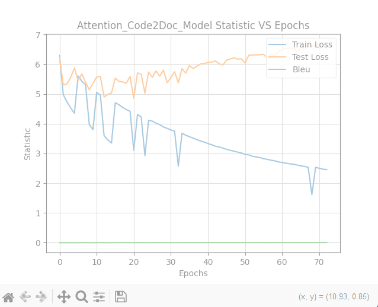
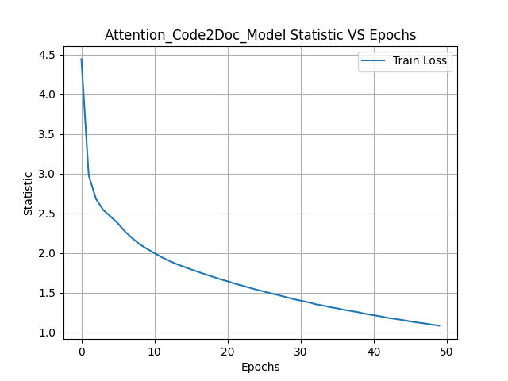

# Semantic Code Search

## Project Summary

A hands-on implementation of **semantic code search** using deep learning. Inspired by GitHub’s CodeSearchNet, this project builds a neural search engine that retrieves the most relevant code snippets for a given natural language query. For example, for the query **"Create a sorted list"**, the model returns suggestions like: `sorted(list)`, `list.sort()`, and other semantically similar code examples. This project was built for learning purposes to deepen understanding of **Transformer-based architectures** and their application in **natural language and code representation**.
## Resources

- **CodeSearchNet by GitHub**: [https://wandb.ai/github/codesearchnet/benchmark](https://wandb.ai/github/codesearchnet/benchmark)  
- **HuggingFace CodeSearchNet Dataset**: [https://huggingface.co/datasets/code-search-net/code_search_net](https://huggingface.co/datasets/code-search-net/code_search_net)  
- **GitHub Blog — Towards Natural Language Semantic Code Search**: [https://github.blog/ai-and-ml/machine-learning/towards-natural-language-semantic-code-search/](https://github.blog/ai-and-ml/machine-learning/towards-natural-language-semantic-code-search/)

## Major Milestones
[ ] **Constructe a sequence-to-squence model from code and documentation pairs**

[ ] **Built a general purpose text encoder**

[ ] **Train the model to map code into a shared embedding space with natural language description**

[ ] **Create frontend and backend for model deployment (Optional)**

## Development Log
### 2025_0709 — Implemented the Transformer Architecture

- Implemented the Transformer encoder and decoder.
- Training time is too long. 
- **Potential Solutions**:
  1. Study torch optimization for transformers.
  2. Use huggingface API for transformers.

---

### 2025_0628_3 — Applied Class Weighting

- The model shows no signs of overfitting during the first ~30 epochs.
- Overfitting begins to emerge afterward.

---

### 2025_0628_2 — Implemented Label Smoothing

- Added label smoothing to mitigate overfitting.
- Overfitting was reduced in the first ~10 epochs, but signs reappeared later.
- The model still tends to overuse frequent tokens to minimize loss.
- **Potential Solutions**:
  1. Apply class weighting to penalize frequent tokens.
  2. Use a substring-based tokenizer to preserve semantics of rare tokens.

---

### 2025_0628 — Early Overfitting Mitigation Techniques

- Applied weight decay.
- Adjusted the teacher forcing ratio.
- Tuned dropout rate and learning rate.
- Overfitting still observed despite these interventions.

---

### 2025_0627 — Seq2Seq on Code-to-Documentation Dataset

- Overfitting observed during training.
- The model leans heavily on frequent tokens to reduce training loss.

---

### 2025_0627 — Seq2Seq on French-to-English Dataset

- Implemented a sequence-to-sequence model using an RNN encoder and a decoder with additive attention and RNN.
- Successfully validated model performance on a basic English-to-French translation task.

---
